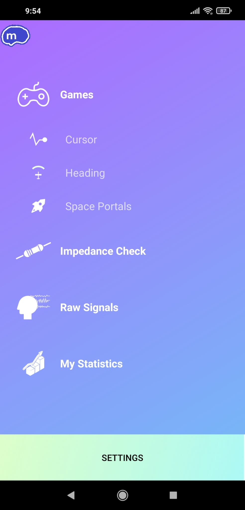
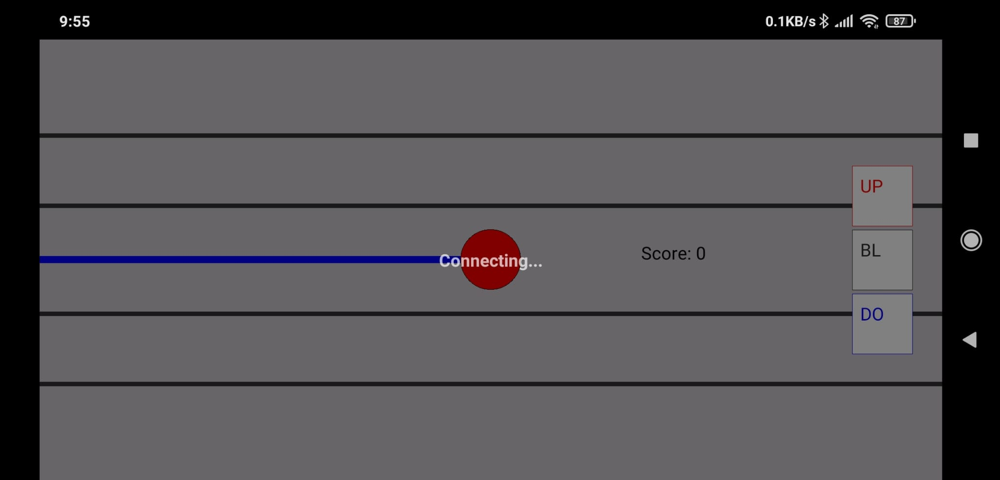

  

<h3 align="center">mindX by mindreach</h3>

---

## About 

Android app to connect to the mindreach headset for brain activity training through operant learning and control of several games:

 </a>

## 💭 Screenshots 
### Landing page in app:
</a>
### Main menu:
</a>
### Settings page (can select attractor strength, input values for ranges and threshols and connect to headset):
</a>

Impedance check:

</a>

Games controlled by activity recroded with headset:

</a>
</a>

